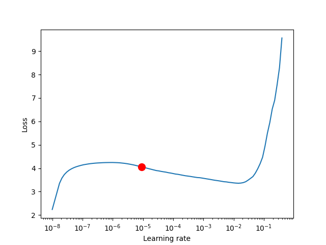

# Research journal

[Weights and Biases](https://wandb.ai/jfisher40/gpt-shakespeare?workspace=user-jfisher40)


## Nov 6th, 2023

### v0.0.19

Ran the learning rate finder for lr_gpt3_small, looks kinda wonky:



It suggests 1e-5. This is about 1/2x what I was using previously (6e-4). That learning rate is for the tokenized input, which is actually almost twice as big as my model (since the LM and embedding heads are enormous). In principle, you can use a larger learning rate for smaller models. Moreover, the training dynamics looked good for the previous run, which uses a larger learning rate than suggested by this algorithm.

We'll procede with using the 

TODO:
- [ ] implement the gpt3 scheduler 

Rerunning with the same learning rate, this time with learning rate logging so it's more clear what the effect of training your 

### v0.0.18

Ran gpt3-small-one cycle: https://wandb.ai/jfisher40/gpt-shakespeare/runs/x5i0gsq7?workspace=user-jfisher40

 - Test loss going down after three epochs, which is already an improvement!
 - Will probably let this run for another hour, `logging_interval` isn't set correctly so I can't see what the LR actually is...
 - Test loss continues to go down, with a very interesting kink after 300 steps; unfortunately, its hard to tell because the learning rate isn't being reported 

Implemented an auto learning rate finder ingress (`gpt/cli.py find-lr`) using the [built-in LR finder from pytorch_lightning](https://lightning.ai/docs/pytorch/2.1.0/advanced/training_tricks.html#using-lightning-s-built-in-lr-finder).

Sylvain Gugger found that `one_cycle_lr` scheduling allowed higher maximum learning rates than what would be suggested by the lr finder approach (i.e., allowing use of the minima, rather than the steepest part of the curve).

> Surprisingly, applying this policy even allows us to pick larger maximum learning rates, closer to the minimum of the plot we draw when using the learning rate finder. Those trainings are a bit more dangerous in the sense that the loss can go too far away and make the whole thing diverge. In those cases, it can be worth to try with a longer cycle before going to a slower learning rate, since a long warm-up seems to help.

https://sgugger.github.io/the-1cycle-policy.html

Added a gradient accumulation flag. According to Raschka, we might have an issue with such a small batch size.

> The problem with batch sizes of 1 is that the gradient updates will be extremely noisy, as we can see based on the fluctuating training loss and poor test set performance below when we train the model:

https://lightning.ai/blog/gradient-accumulation/

Created a configuration for a larger simulated batch for gpt3 small.

TODO:
- [x] Use the new LR finder
- [x] Set the `logging_interval` to step
- [ ] Rerun with larger simulated batch, suggested lr (seperately, I guess...) 

## Nov 5th, 2023 

### v0.0.17

Ran a char-gpt3-small but the loss immediately started going up: https://wandb.ai/jfisher40/gpt-shakespeare/runs/tefjimbq?workspace=user-jfisher40

Trying one cycle.

Adding a learning rate reporter so I can keep track of that .

### v0.0.16

Removed unused code

Accidentally ran a baby gpt: https://wandb.ai/jfisher40/gpt-shakespeare/runs/2deftpzo/overview?workspace=user-jfisher40

Pretty good results honestly:

> year and 1993 cpus). however, new york city consti 
> fierceptochemistry, protein welling procedure awak 
> vowel of students "to quickly desire 90,000 to vow 

Removed `baby` as default in the makefile. Now, we'll have to specify the config.

### v0.0.15

Added gpt3 with character tokenization.

### v0.0.14

Fixed an off-by-one issue with the number of valid blocks.

Saturday vRAM for gpt3-small config.

Tripled the dataset size. (Aiming for a 7-8 hour training run.)

Running `gpt3-small`: https://wandb.ai/jfisher40/gpt-shakespeare/runs/ar581m1u

Training loss is stagnant. Let's retry with character tokenization.

### v0.0.13

Passed the block to the model, then created the shifted sequence within the model code. Still getting 9-10 iterations/second. Reverting.

Added a `mini_v1` configuration that saturates vRAM on my 3090 with the same baseline model. (By increasing batch size.)

Tokens blocks are now non-overlapping. The previous method re-used tokens within the same epoch. If we want to re-use tokens, we should probably just increase the size of the wikipedia subset. Attention is a set operation, so I don't think the token order matters -- but dataset size definitely does

Added more wikipedia articles to increase the total number of 

### v0.0.12

Did something, generation is immediately better:

> the spidet  in the all ware musculates, ussidessar

I think it was loaded a cached tokenization of the dataset, but the token2number scheme changed each run.

Tried a few optimizations:

- Re-added `bf16-mixed`. This gives us 9-10 iterations per second.
- Running with [assertions disabled](https://stackoverflow.com/questions/1273211/disable-assertions-in-python). This gives us 9-10 iterations per second.
- Couldn't get `torch.compile` and triton working :\

### v0.0.11

Add `lru_cache`` in front of the pre-chunked tokens for speed.

Running an interactive session, it looks like my data is garbage! No wonder it wasn't generating anything interesting.

```python
>>> example, _  = next(iter(dm.train_dataloader()))
>>> dm.decode(example[0,:])
'`g/\\^~q|\\1 \\g(|\\|g<3p1|j1y y1b|6~ky@ ~0^~~ b|\\1 \\g(|\\|g<3p1|j1y y1b|6~ky@ ~00gky<g|\\qf|_3\\1g0|\\1 \\g|/~p`~(|\\|]3p,~p|^~p,\\q|gky<_jy fyq^|@3,<\\qb0|(|1k~|q\\,~|3]|g~6~p\\ |p3b\\ |q\\6b|gky<g0|g1|\\1 \\g(|\\|g/~fygk|1j^_3\\10|(|1k~|q\\,~|3]|g~6~p\\ |j?g?|q\\6b|gky<g001p\\'
```

### v0.0.10

Ensmallening dataset by 10x (240h to 24h).

Running `gpt_mini_v0`: https://wandb.ai/jfisher40/gpt-shakespeare/runs/2azvtzer?workspace=user-jfisher40

Getting 6-7 iterations per second.

Intermediate results look terrible.

### v0.0.9

Parsing the [profiling logs](https://wandb.ai/jfisher40/gpt-shakespeare/runs/2m93vv6q/logs?workspace=user-jfisher40) show that all time was spent in the `val_next` and `train_dataloader_next` calls. Perhaps 

I followed the [recommendations at huggingface](https://huggingface.co/docs/datasets/v2.14.5/en/use_with_pytorch#use-multiple-workers) to improve dataloader performance and we're getting a 100x speed up! The trick was to save the dataset dict to disk, then re-load it. This enables memory mapping in the dataset object, which then gets passed to each worker; this allows each worker to access the data independantly. Previously, I guess we we're spending all of our time waiting for a resource lock. Might be interesting to loop into dataloader internals, because I thought that each process would get a 

Potential improvements/speedups:
- Verify that the device transfer is relatively quick
- Perhaps create the shifted/label sequence from a source sequence to avoid passing around x, y pairs all over the place
- Check if the indexing is slow enough to be worth optimizing
- Add the index to the dataset dict itself to avoid recomputing each run

Running `gpt_mini_v0`: https://wandb.ai/jfisher40/gpt-shakespeare/runs/27efuwbt

## v0.0.8

Added a variety of features:
- `--dirty` flag to prevent runs with uncommited files
- BPE tokenization through Huggingface (I'd like to actually implement this myself though)
- Profiling
- Using all tokens within a dataset
- VastAI scaffolding if I decide to scale up to A100s/H100s

Notes:
- Very bottlenecked by dataloader (should I reduce processes?)

## October 27th, 2023

### v0.0.0

Resuscitated the project, added very hacky wikipedia data loading. (Only 1 token/article was used.)

https://wandb.ai/jfisher40/gpt-shakespeare/runs/2a70mtrg/overview?workspace=user-jfisher40


Config: `gpt_mini_v0`

| hyperparam          | value |
|---------------------|-------|
| batch_size          | 128   |
| block_size          | 256   |
| lr                  | 0.001 |
| n_embed             | 512   |
| n_epochs            | 1     |
| n_heads             | 8     |
| n_layers            | 10    |
| one_cycle_scheduler | false |
| p_dropout           | 0.2   |
| test_train_split    | 0.1   |
| vocab_size          | 75    |

Dataset: [`wikipedia`](https://huggingface.co/datasets/wikipedia/viewer/20220301.en) (1 token/article)

Selected generations:
> sionry (1864). he is best known for many fasc
> re guided. unfortunately,   von reek rangeren
> red two japanese chicago derbys in 1998 being