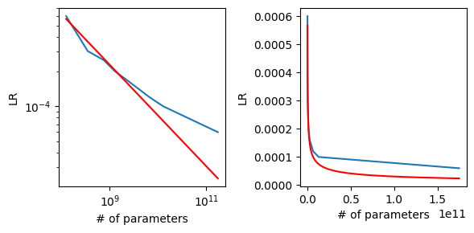

# Research journal


[Weights and Biases](https://wandb.ai/jfisher40/gpt-shakespeare?workspace=user-jfisher40)

This document is a hybrid changelog/research journal to document all my modeling and infrastructure choices.


## Nov 20-23th

### v0.0.47

Running on all of wikipedia: https://wandb.ai/jfisher40/gpt-shakespeare/runs/3oky6flm/workspace?workspace=user-jfisher40

Killed slightly before finishing all of wikipedia b/c I'm not sure if it would save the checkpoint from the last bit ([`ModelCheckpoint` callback API is confusing.](https://lightning.ai/docs/pytorch/stable/api/lightning.pytorch.callbacks.ModelCheckpoint.html))

Final loss: 0.775

Really good results, qualitatively:
> a stupid, but too far too water-friendly pierce wo 
> standard rally category theorem, now referring to
> these pieces create a topical response, and the wo 

Running `gpt/inference.pt` gives GREAT results. Adding it to the readme.


Fix an issue where the model was being compiled (due to it  being the default in the `GptLightning` constructor), but it was NOT compiled during training. Solution was to prevent it from being compiled during inference. Made a note of it in the [PyTorch Lightning GH](https://github.com/Lightning-AI/lightning/issues/17120#issuecomment-1824815091).

Training resumption looks like its working as well. I refactored the data download script to use `gsutil` because I don't trust huggingface datasets to download in the quickest manner. It removes some generality but eh...

Let's see if can get the last bit of training done locally to exercise resumability: https://wandb.ai/jfisher40/gpt-shakespeare/runs/ho2rgbg7

It looks like resuming with a different batch size just isn't feasible. This is a pretty major constraint.

## Nov 9th, 2023

### v0.0.35

Lots of changes to get the deployment working with docker, hopefully to get it working on vast.ai as well. Experiments getting the env working have not been successful. Now trying to base the env on one of the docker images that I expect to be cached on vastai machines.

### v0.0.28

Added resumable training.

I think we're ready for VastAI.

Let's give ourselves a challenge of training on all of wikipedia.

### v0.0.27

Get `torch.compile` working in a docker container with about 4 iterations/second with gpt3-small-char. Needs a bit more work, specifically to patch in the wandb credentials, etc. This is a good project so we can make sure the docker image works before renting out a vastai instance. 

Removing the compile step gives 4.28 :/

Will leave it in for now, when I increase the batch size it seems to make no difference. Perhaps better GPUs will take better advantage of this.

Made the training loop multi-GPU compatible for the hell of it.

Running gpt-small-char with increased learning rate using the new docker stuff: https://wandb.ai/jfisher40/gpt-shakespeare/runs/y16802t7?workspace=user-jfisher40

Trying to figure out how people count tokens. I downloaded 75K articles and tokenized them. With a block size of 2048, there are 426,488 non-overlapping blocks. Multiplying these together, we get 873,447,424 character tokens.

Let's assume 5 letters/word, and 3/4 token per word. That gives us 0.15 tokens/letter, which is 131,017,113 tokens.

That's from 75K articles, but there are 6.7M articles on English wikipedia. That's 1%. So (6,742,357/75,000) * 131,017,113 = 11,778,188,652.7 = 11B tokens. This isn't exactly the 3B that the few shot paper indicates, but since we only samples 1% of the data, its a reasonable difference.

**Conclusion**: they are counting every token in the block, not just the last one. 

Here are the cost data for training on all of wikipedia:

| GPU  | vRAM per GPU | n GPUS | Cost/Hour | Batch size per GPU | Estimated batch size | Seconds per Batch | Time seconds | Time Hours  | Time days   | Total cost  |
|------|--------------|--------|-----------|--------------------|----------------------|-------------------|--------------|-------------|-------------|-------------|
| 4090 |           24 |      4 |      1.68 |                 32 |                  128 |                 1 |  297500.6104 | 82.63905843 | 3.443294101 | 138.8336182 |
| 4090 |           24 |      2 |     0.463 |                 32 |                   64 |                 1 |  595001.2207 | 165.2781169 | 6.886588203 | 76.52376811 |
| 3090 |           24 |      2 |     0.367 |                 32 |                   64 |                 1 |  595001.2207 | 165.2781169 | 6.886588203 | 60.65706889 |
| 3090 |           24 |      1 |         0 |                 32 |                   32 |                 1 |  1190002.441 | 330.5562337 | 13.77317641 |           0 |
| 3090 |           24 |      4 |     1.321 |                 32 |                  128 |                 1 |  297500.6104 | 82.63905843 | 3.443294101 | 109.1661962 |
| A100 |           40 |      2 |     3.202 |                 50 |                  100 |                 1 |  380800.7813 | 105.7779948 |  4.40741645 | 338.7011393 |

[Finished training](https://wandb.ai/jfisher40/gpt-shakespeare/runs/y16802t7?workspace=user-jfisher40) in record time: 4h! Also the lowest validation loss of 0.942. Still seeing the bizarre staircase curvature, even with a constant learning rate. Is there a hidden warmup? So weird.

I should try 10x the learning rate.

## Nov 8th, 2023

### v0.0.24

Running gpt3-small-one-cycle-v2: https://wandb.ai/jfisher40/gpt-shakespeare/runs/sejest2n/overview?workspace=user-jfisher40

Final loss: 1.039

Looks like the loss was highest when learning rate was 8e-4.

Running gpt3-small-char with the learning rate suggested by the power law computation earlier (0.00025)

### v0.0.23

Increased batch size to 4 with 32 gradient accumulation steps (i.e., simulated batch size of 128). Increased LR to 2e-4 for the one-cycle policy.

Running gpt3-small-one-cycle: https://wandb.ai/jfisher40/gpt-shakespeare/runs/t4ec765m/overview?workspace=user-jfisher40

This loss curve is FASCINATING.

We learned earlier that a warm-up period is essential. A low learning rate (1e-5) is apropriate for this initial period. However, the test loss plateaus at 2.4 until it reaches it maximum at 2e-4. Then loss drops rapidly until reaching 1.3, at which point the learning rate starts to decrease. The loss plateaus at 1.7 for the remaining 1/4 of the run. The training loss and the test loss are similar.

Analysis:
- The training algorithm can sustain a much higher learning rate for more data. 
- It absolutely needs to train at max learning rate for much longer
- Perhaps we can use a simple warm-up followed by a high learning rate for most of the curve. Cool-down does not seem to be relevant here -- probably too little data to matter

TODO:
- [x] Is this supposed to be cyclic? Should I be running this cycle more than once? Answer: no, that's expected

Final loss: 1.133

Added `gpt3-small-one-cycle-v2` with higher learning rate.

### v0.0.22

Batching gm3-small increases from 2.5 to 3 interations/second. Using flash attention increases iterations from 3 to 6.5 iterations/second. Combined 2.6x speedup. Nice :D

For future comparison, loss goes to 1.292.

TODO:
- [ ] Verify the LR scheduler is actually working, since the LR monitor thing does NOT report any changes

For now, rerunning with these optimizations to gain some confidence in lack of bugs. Honestly, I'm pretty confident, since using flash attention means the only bug surface is in the QKV transform.

Just peaked at `nvidia-smi`:

```
Wed Nov  8 10:08:16 2023       
+-----------------------------------------------------------------------------+
| NVIDIA-SMI 525.147.05   Driver Version: 525.147.05   CUDA Version: 12.0     |
|-------------------------------+----------------------+----------------------+
| GPU  Name        Persistence-M| Bus-Id        Disp.A | Volatile Uncorr. ECC |
| Fan  Temp  Perf  Pwr:Usage/Cap|         Memory-Usage | GPU-Util  Compute M. |
|                               |                      |               MIG M. |
|===============================+======================+======================|
|   0  NVIDIA GeForce ...  Off  | 00000000:0C:00.0  On |                  N/A |
| 58%   66C    P2   342W / 350W |   9951MiB / 24576MiB |     99%      Default |
|                               |                      |                  N/A |
+-------------------------------+----------------------+----------------------+
                                                                               
+-----------------------------------------------------------------------------+
| Processes:                                                                  |
|  GPU   GI   CI        PID   Type   Process name                  GPU Memory |
|        ID   ID                                                   Usage      |
|=============================================================================|
|    0   N/A  N/A       904      G   /usr/lib/xorg/Xorg                226MiB |
|    0   N/A  N/A      1259      G   /usr/bin/gnome-shell               53MiB |
|    0   N/A  N/A     13405      G   ...RendererForSitePerProcess       91MiB |
|    0   N/A  N/A     13520      G   ...0/usr/lib/firefox/firefox      250MiB |
|    0   N/A  N/A   2367168      C   python                           9324MiB |
+-----------------------------------------------------------------------------+
```

It's running at 1/2 the vRAM as before!!!

We can definitely up the batch size. (Nice.)

It seems that the scheduler only steps every epoch by default. 

> If a learning rate scheduler is specified in configure_optimizers() with key "interval" (default “epoch”) in the scheduler configuration, Lightning will call the scheduler’s .step() method automatically in case of automatic optimization.

([Source](https://lightning.ai/docs/pytorch/stable/api/lightning.pytorch.core.LightningModule.html#lightning.pytorch.core.LightningModule.configure_optimizers))

Let's change that method.

```python
    def configure_optimizers(self):
        optimizer = torch.optim.AdamW(self.parameters(), lr=self.config.lr)
        if self.config.one_cycle_scheduler is False:
            return optimizer
        else:
            return {
                "optimizer": optimizer,
                "lr_scheduler": {
                    "scheduler": torch.optim.lr_scheduler.OneCycleLR(
                        optimizer,
                        max_lr=self.config.lr,
                        total_steps=self.trainer.estimated_stepping_batches,
                    ),
                    "interval": "step",
                    "frequency": 1,  # Update the LR every step
                    "monitor": "tst_loss",  # Not relevant for OneCycleLR
                    "strict": True,  # Doesn't need to be strict because the monitor is irrelevant
                },
            }
```

My analysis here is based off incorrect assumptions

> It suggests 1e-5. This is about 1/2x what I was using previously (6e-4). That learning rate is for the tokenized input, which is actually almost twice as big as my model (since the LM and embedding heads are enormous). In principle, you can use a larger learning rate for smaller models. Moreover, the training dynamics looked good for the previous run, which uses a larger learning rate than suggested by this algorithm.

Looks like the earlier improvements in v0.0.18 comes from reducing the learning rate, rather than scheduling it. To be clear, the configuration is 6e-4, but bugged LR scheduler sets that to a flat 4e-5. So it looks like training slower is important, at least to begin with. However, I think we can get away with an even higher LR because the suggestion does NOT account for the fact that max LR rates can be much higher when using the one cycle policy. In fact, it really should be higher due to the fact that this model is a character-transformer, meaning that there are a LOT fewer parameters (80M vs 125M).

What should the LR be going off the few shot papers?



Well, that's power law-ish. So, a fitted power law does a good job matching the low-parameter models. Here's the code:


```python
import numpy as np
from scipy.optimize import curve_fit
import matplotlib.pyplot as plt

# Data
x = np.array([125, 350, 760, 1300, 2700, 6700, 13000, 175000]) * 1e6
y = np.array([6, 3, 2.5, 2, 1.6, 1.2, 1, 0.6]) * 1e-4

def power_law(x, a, b):
    return a * (x ** b)

# Fit the power law to the data
(a, b), covariance = curve_fit(power_law, x, y)
```

Note,

`(a,b) == (1.9518162170413254, -0.43679859313753605)`

So:

```python
>>> lr_suggested, = y_fit = power_law(np.array([86.7])*1e6 * 10, a, b)
>>> lr_suggested
0.0002434023432448559
```

Let's change it to 2e-4

TODO:
- [ ] it would be cool to run the vocab size experiments

Looks like it got keyboard interrupted by accident. I feel like this experiment was a success: I feel confident in the optimizations producing at least as good results as the original implementation. I'm ready to experiment with bigger batches and higher LRs at this point.

## Nov 6th, 2023

### v0.0.20

Running gpt3-small-one-cycle with minor bug fix: https://wandb.ai/jfisher40/gpt-shakespeare/runs/xkknl263

I keep on forgetting to write this down. TODO:

- [ ] Check [Karpathy's dataloader](https://github.com/karpathy/nanoGPT/blob/master/data/shakespeare_char/prepare.py) implementation to see if he uses overlapping sequences or not
- [ ] Implement [weight tying](https://paperswithcode.com/method/weight-tying)

> Weight Tying improves the performance of language models by tying (sharing) the weights of the embedding and softmax layers. This method also massively reduces the total number of parameters in the language models that it is applied to.
>
> Language models are typically comprised of an embedding layer, followed by a number of Transformer or LSTM layers, which are finally followed by a softmax layer. Embedding layers learn word representations, such that similar words (in meaning) are represented by vectors that are near each other (in cosine distance). [Press & Wolf, 2016] showed that the softmax matrix, in which every word also has a vector representation, also exhibits this property. This leads them to propose to share the softmax and embedding matrices, which is done today in nearly all language models. 

https://paperswithcode.com/method/weight-tying

Getting good results at 95000:
> succeptic technology caused proteins to demonstra
>  in 1989. the procedural review was the source of
> lee was held by valid jacquir walker at a few octo

Added more efficient transformer ops (batched QKV and flash attention) under the `batch_kqv` and `flash` configuration flags.

Generations are way too frequent.

#### v0.0.19

Ran the learning rate finder for lr_gpt3_small, looks kinda wonky:


It suggests 1e-5. This is about 1/2x what I was using previously (6e-4). That learning rate is for the tokenized input, which is actually almost twice as big as my model (since the LM and embedding heads are enormous). In principle, you can use a larger learning rate for smaller models. Moreover, the training dynamics looked good for the previous run, which uses a larger learning rate than suggested by this algorithm.

We'll procede with using the original LR.

TODO:
- [ ] implement the gpt3 scheduler

Rerunning with the same learning rate, this time with learning rate logging so it's more clear what the effect of training with a scheduler.

#### v0.0.18

Ran gpt3-small-one cycle: https://wandb.ai/jfisher40/gpt-shakespeare/runs/x5i0gsq7?workspace=user-jfisher40

 - Test loss going down after three epochs, which is already an improvement!
 - Will probably let this run for another hour, `logging_interval` isn't set correctly so I can't see what the LR actually is...
 - Test loss continues to go down, with a very interesting kink after 300 steps; unfortunately, its hard to tell because the learning rate isn't being reported 

Implemented an auto learning rate finder ingress (`gpt/cli.py find-lr`) using the [built-in LR finder from pytorch_lightning](https://lightning.ai/docs/pytorch/2.1.0/advanced/training_tricks.html#using-lightning-s-built-in-lr-finder).

Sylvain Gugger found that `one_cycle_lr` scheduling allowed higher maximum learning rates than what would be suggested by the lr finder approach (i.e., allowing use of the minima, rather than the steepest part of the curve).

> Surprisingly, applying this policy even allows us to pick larger maximum learning rates, closer to the minimum of the plot we draw when using the learning rate finder. Those trainings are a bit more dangerous in the sense that the loss can go too far away and make the whole thing diverge. In those cases, it can be worth to try with a longer cycle before going to a slower learning rate, since a long warm-up seems to help.

https://sgugger.github.io/the-1cycle-policy.html

Added a gradient accumulation flag. According to Raschka, we might have an issue with such a small batch size.

> The problem with batch sizes of 1 is that the gradient updates will be extremely noisy, as we can see based on the fluctuating training loss and poor test set performance below when we train the model:

https://lightning.ai/blog/gradient-accumulation/

Created a configuration for a larger simulated batch for gpt3 small.

TODO:
- [x] Use the new LR finder
- [x] Set the `logging_interval` to step
- [ ] Rerun with larger simulated batch, suggested lr (seperately, I guess...) 

## Nov 5th, 2023 

#### v0.0.17

Ran a char-gpt3-small but the loss immediately started going up: https://wandb.ai/jfisher40/gpt-shakespeare/runs/tefjimbq?workspace=user-jfisher40

Trying one cycle.

Adding a learning rate reporter so I can keep track of that.

#### v0.0.16

Removed unused code

Accidentally ran a baby gpt: https://wandb.ai/jfisher40/gpt-shakespeare/runs/2deftpzo/overview?workspace=user-jfisher40

Pretty good results honestly:

> year and 1993 cpus). however, new york city consti 
> fierceptochemistry, protein welling procedure awak 
> vowel of students "to quickly desire 90,000 to vow 

Removed `baby` as default in the makefile. Now, we'll have to specify the config.

#### v0.0.15

Added gpt3 with character tokenization.

#### v0.0.14

Fixed an off-by-one issue with the number of valid blocks.

Saturday vRAM for gpt3-small config.

Tripled the dataset size. (Aiming for a 7-8 hour training run.)

Running `gpt3-small`: https://wandb.ai/jfisher40/gpt-shakespeare/runs/ar581m1u

Training loss is stagnant. Let's retry with character tokenization.

#### v0.0.13

Passed the block to the model, then created the shifted sequence within the model code. Still getting 9-10 iterations/second. Reverting.

Added a `mini_v1` configuration that saturates vRAM on my 3090 with the same baseline model. (By increasing batch size.)

Tokens blocks are now non-overlapping. The previous method re-used tokens within the same epoch. If we want to re-use tokens, we should probably just increase the size of the wikipedia subset. Attention is a set operation, so I don't think the token order matters -- but dataset size definitely does

Added more wikipedia articles to increase the total number of 

#### v0.0.12

Did something, generation is immediately better:

> the spidet  in the all ware musculates, ussidessar

I think it was loaded a cached tokenization of the dataset, but the token2number scheme changed each run.

Tried a few optimizations:

- Re-added `bf16-mixed`. This gives us 9-10 iterations per second.
- Running with [assertions disabled](https://stackoverflow.com/questions/1273211/disable-assertions-in-python). This gives us 9-10 iterations per second.
- Couldn't get `torch.compile` and triton working :\

#### v0.0.11

Add `lru_cache` in front of the pre-chunked tokens for speed?

Running an interactive session, it looks like my data is garbage! No wonder it wasn't generating anything interesting.

```python
>>> example, _  = next(iter(dm.train_dataloader()))
>>> dm.decode(example[0,:])
'`g/\\^~q|\\1 \\g(|\\|g<3p1|j1y y1b|6~ky@ ~0^~~ b|\\1 \\g(|\\|g<3p1|j1y y1b|6~ky@ ~00gky<g|\\qf|_3\\1g0|\\1 \\g|/~p`~(|\\|]3p,~p|^~p,\\q|gky<_jy fyq^|@3,<\\qb0|(|1k~|q\\,~|3]|g~6~p\\ |p3b\\ |q\\6b|gky<g0|g1|\\1 \\g(|\\|g/~fygk|1j^_3\\10|(|1k~|q\\,~|3]|g~6~p\\ |j?g?|q\\6b|gky<g001p\\'
```

#### v0.0.10

Ensmallening dataset by 10x (240h to 24h).

Running `gpt_mini_v0`: https://wandb.ai/jfisher40/gpt-shakespeare/runs/2azvtzer?workspace=user-jfisher40

Getting 6-7 iterations per second.

Intermediate results look terrible.

#### v0.0.9

Parsing the [profiling logs](https://wandb.ai/jfisher40/gpt-shakespeare/runs/2m93vv6q/logs?workspace=user-jfisher40) show that all time was spent in the `val_next` and `train_dataloader_next` calls. Perhaps 

I followed the [recommendations at huggingface](https://huggingface.co/docs/datasets/v2.14.5/en/use_with_pytorch#use-multiple-workers) to improve dataloader performance and we're getting a 100x speed up! The trick was to save the dataset dict to disk, then re-load it. This enables memory mapping in the dataset object, which then gets passed to each worker; this allows each worker to access the data independantly. Previously, I guess we we're spending all of our time waiting for a resource lock. Might be interesting to look into dataloader internals, because I thought that each process would get a code of the data and it wouldn't matter.

Potential improvements/speedups:
- Verify that the device transfer is relatively quick
- Perhaps create the shifted/label sequence from a source sequence to avoid passing around x, y pairs all over the place
- Check if the indexing is slow enough to be worth optimizing
- Add the index to the dataset dict itself to avoid recomputing each run

Running `gpt_mini_v0`: https://wandb.ai/jfisher40/gpt-shakespeare/runs/27efuwbt

### v0.0.8

Added a variety of features:
- `--dirty` flag to prevent runs with uncommited files
- BPE tokenization through Huggingface (I'd like to actually implement this myself though)
- Profiling
- Using all tokens within a dataset
- VastAI scaffolding if I decide to scale up to A100s/H100s

Notes:
- Very bottlenecked by dataloader (should I reduce processes?)

### October 27th, 2023

#### v0.0.0

Resuscitated the project, added very hacky wikipedia data loading. (Only 1 token/article was used.)

https://wandb.ai/jfisher40/gpt-shakespeare/runs/2a70mtrg/overview?workspace=user-jfisher40


Config: `gpt_mini_v0`

| hyperparam          | value |
|---------------------|-------|
| batch_size          | 128   |
| block_size          | 256   |
| lr                  | 0.001 |
| n_embed             | 512   |
| n_epochs            | 1     |
| n_heads             | 8     |
| n_layers            | 10    |
| one_cycle_scheduler | false |
| p_dropout           | 0.2   |
| test_train_split    | 0.1   |
| vocab_size          | 75    |

Dataset: [`wikipedia`](https://huggingface.co/datasets/wikipedia/viewer/20220301.en) (1 token/article)

Selected generations:
> sionry (1864). he is best known for many fasc
> re guided. unfortunately,   von reek rangeren
> red two japanese chicago derbys in 1998 being